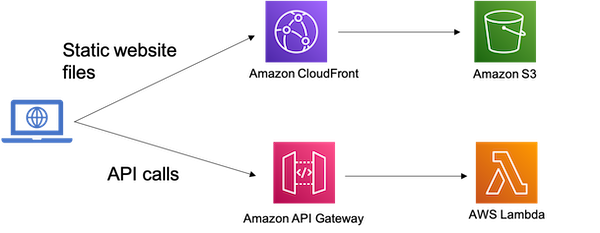

# Dynamic Static Website Configuration with AWS CDK

Static website App or Single Page App(SPA) often needs to talk to different API endpoints to retrieve data. Usually the API endpoints are different for different environments (Dev/Staging/Prod). The static website needs to maintain these configurations (like API endpoint urls or other environment specific configurations) in somewhere so that it knows where to fetch data during runtime.

It has become prevalant to [leverage Amazon S3 Bucket to deploy static website assets](https://docs.aws.amazon.com/AmazonS3/latest/userguide/WebsiteHosting.html). No server-side processing can be leveraged dynamically to provide these configurations in runtime. 

One approach to achieve this is to build different assets for different environments with different set of configurations, and then deploy the associated built asset into different environments accordingly. This approach requires awareness of API endpoints in build time. But this is not always the case, for example, if you are using [CDK Pipeline](https://aws.amazon.com/blogs/developer/cdk-pipelines-continuous-delivery-for-aws-cdk-applications/).   

Alternatively, a config.js file can be created and uploaded to the S3 bucket hosting the website during deployment time and the webiste imports the config.js file via script tag to provide configurations it required. In this case, the browser requires one more trip to download this file. The networking issue may cause the malfunction of the Web App, not to mention the challenge of syncing the version of the configuration file with the rest of the app.

This repo provides an example on how we can leverage [CloudFormation Custom Resources](https://docs.aws.amazon.com/AWSCloudFormation/latest/UserGuide/template-custom-resources.html) to inject the configuration for static website dynamically in deployment time and use [AWS CDK S3 Deployment Module](https://docs.aws.amazon.com/cdk/api/latest/docs/aws-s3-deployment-readme.html) to deploy your website stack into any given environments. 

## Demo Project

As shown in the diagram below, the demo project includes a simple React Static Website created by [create-react-app](https://reactjs.org/docs/create-a-new-react-app.html#create-react-app) and powered by [aws-north Design System](https://northstar.aws-prototyping.cloud/), and a API Gateway endpoint backend by Lambda function to handle API requests from the UI. [AWS CDK](https://docs.aws.amazon.com/cdk/v2/guide/home.html) is used to define the website hosting and API AWS resources and handle the deployment. 



## Project Structure

This demo project leverages [yarn workspaces](https://classic.yarnpkg.com/blog/2017/08/02/introducing-workspaces/) to manage npm modules under _packages_ folder of this monorepo.

**data-api**: Lambda function for handling API request calls and returning mock data. 

**infra**: The [AWS CDK](https://docs.aws.amazon.com/cdk/v2/guide/home.html) app for defining AWS infrastructure.

**shared**: Shared npm module between modules.

**website**: The Demo React Static Website project created by [create-react-app](https://reactjs.org/docs/create-a-new-react-app.html#create-react-app) and leveraging [NorthStar Design System] for various UI components

**website-index-builder**: Lambda function for building the index.html file via [CloudFormation Custom Resources](https://docs.aws.amazon.com/AWSCloudFormation/latest/UserGuide/template-custom-resources.html.

Specifically, you can find the code in `./packages/website-index-builder/src/index.ts` on how the configurations are injected into the _index.html_ file and the code in `./packages/infra/lib/website-construct.ts` on how the custom resource is defined and how the [S3Deployment construct](https://docs.aws.amazon.com/cdk/api/latest/docs/aws-s3-deployment-readme.html) leverages the output of the custom resource.

All the fields (excludes s3BucketName/template) provided in the properties for the **CustomResource** will be injected as they are into the **window.\_\_config** so that they can be used in the static website app:

```
const buildWebsiteIndexCustomResource = new CustomResource(this, 'BuildWebsiteIndexCustomResource', {
            serviceToken: buildWebsiteIndexCustomResourceProvider.serviceToken,
            properties: {
                s3BucketName: websiteIndexBucket.bucketName,
                template: indexFile,
                apiUrl: props.api.url,
            },
        });
```

Other configurations like Cognito User Pool Id or Cognito App client Id can be injected into the app in the same way.

This setup can also be used to inject the [Content Security Policy Header](https://developer.mozilla.org/en-US/docs/Web/HTTP/CSP) as meta tags in the index.html. In this case, for instance, the value of API url can be used directly in the connect-src.

## Usage

### Deployment

To deploy the example stack to your default AWS account/region, under project root folder, run:

1. `yarn install` to install all the dependencies

2. `yarn build` to build all projects

3. `yarn cdk deploy` to deploy this stack to your default AWS account/region

Once the deployment is completed, you should be able to locate CloudFront Distribution domain Url under the CloudFormation output with prefix _AWSCDKExampleDynamicWebConfigDemoStack.WebsiteConstructCloudfrontDistributionDomainName_. Navigate to that Url in your browser and you should see the UI is able to talk to the API and the data is loaded successfully in the Table with the configurations injected during the deployment.

### Local Development

1. Update the config file located `./packages/website/public/config.js` using the value from CloudFormation output in the console.

The prefix for the API Gateway Endpoint output is _AWSCDKExampleDynamicWebConfigDemoStack.WebsiteAPIConstructDataAPIEndpoint_.

2. Run `yarn start` to run the website project in Dev mode.

## Useful commands

-   `yarn build` build all projects
-   `yarn cdk deploy` deploy this stack to your default AWS account/region
-   `yarn cdk diff` compare deployed stack with current state
-   `yarn cdk synth` emits the synthesized CloudFormation template
-   `yarn start` run the website project in Dev mode
